<div align="center">

# 🚀 GitHub Mastery Course

### *Interactive Learning Platform for Git & GitHub*

[](https://gauravsingh112.github.io/github-mastery-course/)
[](LICENSE)
[](http://makeapullrequest.com)
[]()


**A completely FREE, interactive web course to master Git & GitHub from scratch!**

[📚 Start Learning](#-quick-start) • [✨ Features](#-features) • [🎓 Course Outline](#-course-outline) • [🤝 Contribute](#-contributing)

---

</div>

## 🎯 What is This?

This is a **comprehensive, interactive learning platform** designed specifically for:

- 👨‍💻 **Full Stack Developers** starting with version control
- 🎓 **Students** learning web development
- 🌱 **Complete Beginners** who've never used Git
- 👥 **Development Teams** needing training resources
- 🌍 **Anyone** wanting to master GitHub!

**No installations needed!** Just open in your browser and start learning.

---

## ✨ Features

<table>
  <tr>
    <td align="center">
      <h3>📚</h3>
      <b>11 Complete Chapters</b><br>
      From basics to advanced topics
    </td>
    <td align="center">
      <h3>✅</h3>
      <b>Progress Tracking</b><br>
      Check off chapters as you complete
    </td>
    <td align="center">
      <h3>🎯</h3>
      <b>Interactive Quiz</b><br>
      Test your knowledge instantly
    </td>
  </tr>
  <tr>
    <td align="center">
      <h3>💡</h3>
      <b>Simple Explanations</b><br>
      Complex topics made easy
    </td>
    <td align="center">
      <h3>📝</h3>
      <b>Real Examples</b><br>
      Hands-on code snippets
    </td>
    <td align="center">
      <h3>🎨</h3>
      <b>Beautiful UI</b><br>
      Modern, responsive design
    </td>
  </tr>
</table>

### 🌟 What Makes This Special?

- ✅ **100% Free** - No hidden costs, no sign-ups
- ✅ **Self-Paced** - Learn at your own speed
- ✅ **Interactive** - Click, track progress, take quizzes
- ✅ **Comprehensive** - Everything from `git init` to advanced workflows
- ✅ **Beginner-Friendly** - Real-world analogies for every concept
- ✅ **Color-Coded Learning** - Visual sections for tips, examples, warnings
- ✅ **One File** - No dependencies, just open and learn!

---

## 🚀 Quick Start

### 🌐 **Option 1: Use Online** (Recommended)

Just visit the live demo and start learning immediately:

<a href="https://gauravsingh112.github.io/github-mastery-course-/" target="_blank">
  👉 CLICK HERE TO START LEARNING 👈
</a>


### 💻 **Option 2: Run Locally**

```bash
# Clone the repository
git clone https://github.com/YOUR-USERNAME/github-mastery-course.git

# Navigate to folder
cd github-mastery-course

# Open index.html in your browser
# That's it! No build process needed!
```

### 🔱 **Option 3: Fork & Customize**

1. Click the **Fork** button at the top right
2. Clone your fork
3. Customize content as needed
4. Deploy your own version!

---

## 🎓 Course Outline

<details open>
<summary><b>📘 Beginner Level (Chapters 1-4)</b></summary>

### Chapter 1: Git & GitHub Basics
- What is Git and GitHub?
- Understanding version control
- Key terminology explained

### Chapter 2: Setting Up Environment
- Installing Git (Windows, Mac, Linux)
- Configuring Git
- Connecting VS Code to GitHub

### Chapter 3: Your First Repository
- Creating repositories (2 methods)
- Cloning repositories
- Understanding remote vs local

### Chapter 4: Pushing Code to GitHub
- The three stages of Git
- Complete push workflow
- Understanding commands

</details>

<details>
<summary><b>📗 Intermediate Level (Chapters 5-7)</b></summary>

### Chapter 5: Making Changes & Updates
- Viewing commit history
- Undoing changes
- Pulling updates
- VS Code Git interface

### Chapter 6: Branches Explained
- What are branches and why use them?
- Creating and switching branches
- Branch workflows
- Deleting branches

### Chapter 7: Pull Requests
- Understanding Pull Requests
- Creating PRs on GitHub
- Code review process
- Best practices

</details>

<details>
<summary><b>📕 Advanced Level (Chapters 8-10)</b></summary>

### Chapter 8: Merge & Merge Conflicts
- Simple merges
- Understanding conflicts
- Resolving conflicts manually
- Using VS Code conflict resolution

### Chapter 9: Collaboration Workflow
- Fork vs Clone
- Contributing to open source
- Team collaboration best practices
- Multiple remotes

### Chapter 10: Advanced GitHub Features
- Git Stash
- Git Tags & Versioning
- .gitignore files
- GitHub Pages
- GitHub CLI

</details>

<details>
<summary><b>🎯 Final Assessment (Chapter 11)</b></summary>

### Interactive Quiz
- 10 multiple-choice questions
- Instant feedback
- Scoring system
- Grade: Expert, Advanced, Intermediate, or Beginner

</details>

---

## 📊 Learning Path

```mermaid
graph LR
    A[Start] --> B[Ch 1-4: Basics]
    B --> C[Ch 5-7: Intermediate]
    C --> D[Ch 8-10: Advanced]
    D --> E[Ch 11: Quiz]
    E --> F[🎉 GitHub Master!]
    
    style A fill:#667eea
    style F fill:#4CAF50
```



---

## 🎨 Screenshots

<div align="center">

### Main Interface
*Beautiful gradient design with sidebar navigation*

<div align="center">

### 🎨 Screenshots


<p><em>Main Course Interface</em></p>


<p><em>Track your learning progress</em></p>


<p><em>Test your knowledge</em></p>

</div>

</div>

---

## 🛠️ Built With

- **HTML5** - Structure and content
- **CSS3** - Beautiful styling with gradients
- **Vanilla JavaScript** - All interactivity
- **❤️ Love** - For the developer community

**No frameworks, no dependencies, just pure web technologies!**

---

## 🤝 Contributing

We love contributions! Here's how you can help make this course even better:

### 🌟 Ways to Contribute

- 🐛 **Report bugs** - Found an issue? Let us know!
- 💡 **Suggest features** - Have ideas? We'd love to hear them!
- 📝 **Improve content** - Fix typos, improve explanations
- 🌍 **Translate** - Help make it available in other languages
- ⭐ **Star this repo** - Show your support!

### 📋 How to Contribute

1. **Fork** this repository
2. **Create** a feature branch: `git checkout -b feature/AmazingFeature`
3. **Commit** your changes: `git commit -m 'Add some AmazingFeature'`
4. **Push** to the branch: `git push origin feature/AmazingFeature`
5. **Open** a Pull Request

<div align="center">

**[View Contribution Guidelines](CONTRIBUTING.md)** • **[Code of Conduct](CODE_OF_CONDUCT.md)**

</div>

---

## 📜 License

This project is licensed under the **MIT License** - which means:

✅ **Use** it for personal or commercial projects  
✅ **Modify** it however you want  
✅ **Share** it with anyone  
✅ **Include** it in your own projects  

The only requirement: Keep the copyright notice.

```
MIT License

Copyright (c) 2025 [YOUR NAME]

Permission is hereby granted, free of charge, to any person obtaining a copy
of this software and associated documentation files (the "Software"), to deal
in the Software without restriction, including without limitation the rights
to use, copy, modify, merge, publish, distribute, sublicense, and/or sell
copies of the Software, and to permit persons to whom the Software is
furnished to do so, subject to the following conditions:

The above copyright notice and this permission notice shall be included in all
copies or substantial portions of the Software.

THE SOFTWARE IS PROVIDED "AS IS", WITHOUT WARRANTY OF ANY KIND, EXPRESS OR
IMPLIED, INCLUDING BUT NOT LIMITED TO THE WARRANTIES OF MERCHANTABILITY,
FITNESS FOR A PARTICULAR PURPOSE AND NONINFRINGEMENT. IN NO EVENT SHALL THE
AUTHORS OR COPYRIGHT HOLDERS BE LIABLE FOR ANY CLAIM, DAMAGES OR OTHER
LIABILITY, WHETHER IN AN ACTION OF CONTRACT, TORT OR OTHERWISE, ARISING FROM,
OUT OF OR IN CONNECTION WITH THE SOFTWARE OR THE USE OR OTHER DEALINGS IN THE
SOFTWARE.
```

---

## 💬 Testimonials

<div align="center">

> *"This course helped me understand Git in just a few hours. The interactive format made learning so much easier!"*  
> **— Future GitHub Expert**

> *"Finally, a Git course that explains things in simple terms. Highly recommended for beginners!"*  
> **— Full Stack Developer**

> *"The visual design and progress tracking kept me motivated. Best free course I've found!"*  
> **— Web Development Student**

</div>

---

## 📚 Additional Resources

### 🔗 Official Documentation
- [Git Official Docs](https://git-scm.com/doc)
- [GitHub Docs](https://docs.github.com)
- [GitHub Learning Lab](https://lab.github.com)

### 🎮 Interactive Learning
- [Learn Git Branching](https://learngitbranching.js.org) - Visual Git tutorial
- [Oh My Git!](https://ohmygit.org/) - Learn Git through a game

### 📖 Cheat Sheets
- [Git Cheat Sheet](https://education.github.com/git-cheat-sheet-education.pdf)
- [GitHub Flow Guide](https://guides.github.com/introduction/flow/)

---

## ❓ FAQ

<details>
<summary><b>Do I need any prior programming knowledge?</b></summary>
<br>
No! This course is designed for complete beginners. We explain everything from scratch with simple analogies.
</details>

<details>
<summary><b>Is this really free?</b></summary>
<br>
Yes! 100% free, no hidden costs, no sign-ups required. Just learn!
</details>

<details>
<summary><b>How long does it take to complete?</b></summary>
<br>
At your own pace! Some finish in a few hours, others take a few days. The course is self-paced.
</details>

<details>
<summary><b>Can I use this for my team?</b></summary>
<br>
Absolutely! Share the link with your team, or fork and customize it for your organization.
</details>

<details>
<summary><b>Can I contribute to this project?</b></summary>
<br>
Yes! We welcome all contributions. Check the Contributing section above.
</details>

---

## 📞 Support & Contact

- 💬 **Questions?** Open an [issue](https://github.com/YOUR-USERNAME/github-mastery-course/issues)
- 🐛 **Bug Report?** Submit an [issue](https://github.com/YOUR-USERNAME/github-mastery-course/issues)
- 💡 **Feature Request?** Start a [discussion](https://github.com/YOUR-USERNAME/github-mastery-course/discussions)
- ⭐ **Enjoying it?** Give us a star!

---

## 🎉 Acknowledgments

- 💜 Created with love for the developer community
- 🌟 Inspired by the need for accessible Git education
- 🙏 Thanks to all contributors and learners
- 🚀 Special thanks to GitHub for providing free hosting

---

## 📈 Project Stats

<div align="center">


</div>

---

## 🗺️ Roadmap

- [x] Initial release with 11 chapters
- [x] Interactive quiz system
- [x] Progress tracking
- [ ] Add video tutorials
- [ ] Multi-language support
- [ ] Dark mode toggle
- [ ] Downloadable certificate
- [ ] Mobile app version
- [ ] Community forum integration

---

## 🌟 Star History

<div align="center">

[](https://star-history.com/#YOUR-USERNAME/github-mastery-course&Date)

</div>

---

<div align="center">

## 💝 Show Your Support

If this project helped you, please consider:

⭐ **Starring** this repository  
🔀 **Forking** and sharing with others  
💬 **Sharing** on social media  
☕ **[Buying me a coffee](https://buymeacoffee.com/gauravsr19a)** (optional)

---

### 📱 Connect With Me

[](https://github.com/gauravsingh112)
[]([https://x.com/_iamgsr_])

---

### 🎯 Made with 💜 by [Gaurav Singh]

**Happy Learning! Keep Coding! 🚀**


---

*Last Updated: October 2025*

</div>
